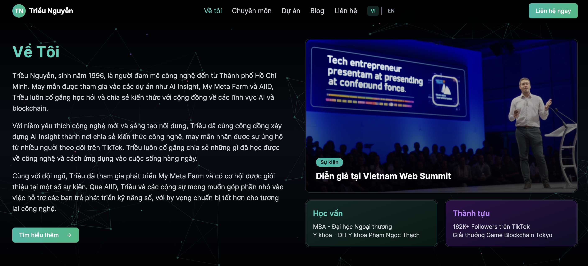

# Hiếu Nguyễn - Professional Investor & AI Entrepreneur Portfolio

<p align="center">
  
</p>

<p align="center">
  <a href="https://github.com/hieunguyen/personal-website">
    
  </a>
  <a href="https://hieu.ai.vn">
    
  </a>
  <a href="https://github.com/hieunguyen/personal-website/blob/main/LICENSE">
    
  </a>
</p>

---

## 📋 Tổng Quan | Overview

**\[Tiếng Việt]**

Website portfolio chuyên nghiệp của Hiếu Nguyễn - Nhà đầu tư chuyên nghiệp và doanh nhân AI. Trang web được xây dựng với Next.js, Tailwind CSS và Framer Motion, đem lại trải nghiệm mượt mà, hiệu ứng hiện đại, thiết kế responsive. Website giới thiệu các dự án nổi bật như **AI Insight**, **My Meta Farm**, **AIID** cùng chuyên môn và thông tin liên hệ.

**\[English]**

Professional portfolio website for Nguyễn Trung Hiếu – Professional Investor and AI Entrepreneur. Built with Next.js, Tailwind CSS, and Framer Motion for a smooth, interactive, responsive experience. Featuring highlighted projects like **AI Insight**, **My Meta Farm**, and **AIID**, plus expertise and contact info.

---

## ✨ Tính Năng Chính | Key Features

* 🌐 **Hỗ trợ đa ngôn ngữ** – Seamless Vietnamese/English toggle
* 🎨 **Thiết kế hiện đại** – Modern dark UI, gradient & particle effects
* 📱 **Responsive** – Perfect display on any device
* ⚡ **Hiệu ứng tương tác** – Smooth animation with Framer Motion
* 🔍 **Tối ưu SEO** – Meta tags & structured data included
* 📬 **Form liên hệ** – Integrated with Supabase for contact info storage
* 🖼️ **Hiển thị dự án** – Attractive project showcase
* 🌟 **Particle Effects** – Interactive headline & background

---

## 🛠️ Công Nghệ Sử Dụng | Technologies

* **Frontend**: Next.js 14, React 18, TypeScript
* **Styling**: Tailwind CSS, Shadcn UI
* **Animation**: Framer Motion, React Particles
* **Database**: Supabase
* **Deployment**: Vercel
* **SEO**: Next.js Metadata API
* **Internationalization**: Custom language context

---

## 🚀 Cài Đặt & Chạy | Installation & Setup

```bash
# Clone repository
git clone https://github.com/hieunguyen/personal-website.git

# Di chuyển vào thư mục dự án
cd portfolio-website

# Cài đặt dependencies
npm install

# Tạo file .env.local và thêm các biến môi trường sau:
# NEXT_PUBLIC_SUPABASE_URL=your_supabase_url
# NEXT_PUBLIC_SUPABASE_ANON_KEY=your_supabase_anon_key
# SUPABASE_SERVICE_ROLE_KEY=your_supabase_service_key

# Chạy development server
npm run dev
```

Truy cập [http://localhost:3000](http://localhost:3000) để xem trang web.

---

## 📁 Cấu Trúc Dự Án | Project Structure

```plaintext
portfolio-website/
├── app/                    # Next.js App Router
│   ├── api/                # API Routes
│   ├── blog/               # Blog pages
│   ├── contact/            # Contact page
│   ├── demo/               # Demo pages
│   ├── projects/           # Projects pages
│   ├── layout.tsx          # Root layout
│   └── page.tsx            # Home page
├── components/             # React components
│   ├── ui/                 # UI (shadcn)
│   ├── card-hover-effect.tsx
│   ├── card-spotlight.tsx
│   ├── contact-form.tsx
│   ├── featured-project.tsx
│   ├── glowing-stars.tsx
│   ├── hero-parallax.tsx
│   ├── hero-section.tsx
│   ├── interactive-text.tsx
│   ├── language-switcher.tsx
│   ├── navbar.tsx
│   ├── particle-text.tsx
│   ├── particles-container.tsx
│   ├── project-card.tsx
│   └── text-reveal.tsx
├── contexts/               # React contexts
│   └── language-context.tsx
├── hooks/                  # Custom hooks
│   └── use-mobile.ts
├── lib/                    # Utility functions
│   └── utils.ts
├── public/                 # Static assets
├── .env.local              # Environment variables
├── next.config.mjs         # Next.js config
├── package.json            # Dependencies
├── tailwind.config.ts      # Tailwind config
└── tsconfig.json           # TypeScript config
```

---

## 📝 Tính Năng Đang Phát Triển | Upcoming Features

* [ ] Dynamic blog (Supabase-powered)
* [ ] AI chatbot integration
* [ ] Dark/light mode switch
* [ ] 3D Portfolio (Three.js)
* [ ] Animation performance optimization
* [ ] Detailed project pages

---

## 👨‍💻 Tác Giả | Author

**Hiếu Nguyễn**

* Website: [hieu.ai.vn](https://hieu.ai.vn)
* TikTok: [@ai\_insight\_](https://tiktok.com/@ai_insight_)
* LinkedIn: [Hiếu Nguyễn](https://linkedin.com/in/hieunguyen)
* Email: [hi@example.com](mailto:hi@example.com)

---

## 📄 Giấy Phép | License

This project is licensed under the MIT License – see the [LICENSE](LICENSE) file for details.

---

<p align="center">
  Developed with ❤️ by Hiếu Nguyễn
</p>
